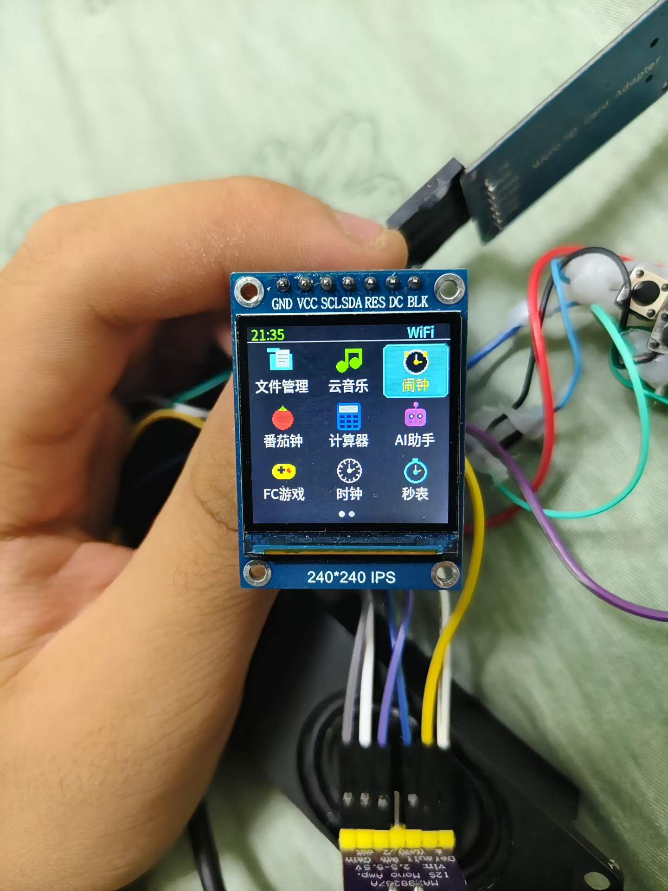

<p align="center">
  
</p>

<h1 align="center">🖥️ ESP32-S3 Cyber OS</h1>

<p align="center">
  <strong>基于 ESP32-S3 (N16R8) 的全能赛博桌面系统</strong>
  <br />
  <em>All-in-One Cyber Desktop System for ESP32-S3</em>
</p>

<p align="center">
  
  
  
  
</p>

---

## 📋 目录 / Table of Contents

- [✨ 功能介绍 / Features](#-功能介绍--features)
- [📸 实机截图 / Screenshot](#-实机截图--screenshot)
- [🛠️ 硬件配置 / Hardware](#️-硬件配置--hardware)
- [📦 所需库 / Required Libraries](#-所需库--required-libraries)
- [🔧 编译与烧录 / Build & Upload](#-编译与烧录--build--upload)
- [📂 项目结构 / Project Structure](#-项目结构--project-structure)
- [🎮 按键操作 / Button Controls](#-按键操作--button-controls)
- [📄 协议 / License](#-协议--license)
- [🙏 开源致谢 / Acknowledgements](#-开源致谢--acknowledgements)

---

## ✨ 功能介绍 / Features

这是一款运行在 **ESP32-S3 (16MB Flash + 8MB PSRAM)** 上的多功能桌面系统，搭载 240×240 圆形 TFT 屏幕，拥有完整的桌面应用生态。

### 🎮 游戏娱乐
| 功能 | 说明 |
|------|------|
| **NES / FC 模拟器** | 完整的 6502 CPU + PPU + APU 模拟，支持多种Mapper，通过 SD 卡加载 `/NES/` 目录下的 ROM 文件 |
| **DOOM 游戏** | 移植自 doomgeneric，在 ESP32-S3 上畅玩经典 FPS |
| **CHIP-8 模拟器** | 经典的 CHIP-8 虚拟机游戏 |

### 🔵 BLE 功能
| 功能 | 说明 |
|------|------|
| **Apple 设备诱骗** | 通过 NimBLE 广播模拟 Apple 设备（iPhone、AirPods、Apple Watch 等）的蓝牙配对包，实现 BLE 设备洪水攻击 |

### 🎵 音乐播放
| 功能 | 说明 |
|------|------|
| **本地音乐** | 播放 SD 卡中的 MP3/M4A/MIDI 音乐文件 |
| **在线云音乐** | 通过网络 API 搜索和在线播放音乐 |
| **随机音乐** | 随机播放 SD 卡中的音乐 |
| **WAV 音乐可视化** | WAV 音频频谱可视化效果 |

### 🕐 实用工具
| 功能 | 说明 |
|------|------|
| **太空人时钟** | 精美太空人动画时钟 + NTP 校时 + 天气显示 |
| **闹钟系统** | 支持最多 3 个闹钟，自定义铃声 |
| **番茄钟** | 番茄工作法计时器 |
| **秒表 / 倒计时** | 精确计时工具 |
| **日历** | 日历查看器 |
| **计算器** | 基础计算器功能 |
| **AI 助手** | 与大语言模型交互的 AI 聊天界面 |

### 📁 文件与系统
| 功能 | 说明 |
|------|------|
| **文件管理器** | SD 卡文件浏览与管理 |
| **文件搜索** | 全文搜索 SD 卡文件 |
| **图片查看器** | 支持 JPG / PNG / GIF / BMP / TGA / PCX 格式 |
| **脚本应用** | 从 `/apps/` 目录加载 Lua 风格脚本应用 |
| **文本 / LRC 歌词** | 文本阅读与歌词显示 |
| **16进制查看器** | 二进制文件 Hex 分析 |
| **Web OS** | 通过网页浏览器上传文件到 SD 卡 |
| **系统仪表盘** | 实时查看 CPU、内存、PSRAM 使用情况 |

### 🎨 其他
| 功能 | 说明 |
|------|------|
| **拼音输入法** | 基于 cJSON 的拼音汉字输入引擎 |
| **WS2812 LED** | 可编程 RGB 灯效 |
| **设置界面** | 系统偏好设置持久化 |

---

## 📸 实机截图 / Screenshot

<p align="center">
  
  <br />
  <em>主桌面界面 — 17+ 个内置应用，支持翻页</em>
</p>

> 将 SD 卡根目录的图片文件通过 Web OS 上传后，即可实现自定义壁纸。

---

## 🛠️ 硬件配置 / Hardware

| 部件 | 参数 |
|------|------|
| **主控** | ESP32-S3 N16R8 (16MB Flash + 8MB PSRAM) |
| **屏幕** | 240×240 圆形/方形 TFT，SPI 接口 |
| **SD 卡** | SPI 模式，用于存储 ROM、音乐、图片等资源 |
| **音频** | I2S 接口 + MAX98357A 功放 |
| **按键** | 5 个物理按键：上 / 确认 / 下 / 左 / 右 |
| **LED** | WS2812 RGB LED x1 |

### 引脚定义 / Pin Map

| 功能 | 引脚 |
|------|------|
| SD 卡 SCK | GPIO 14 |
| SD 卡 MISO | GPIO 19 |
| SD 卡 MOSI | GPIO 13 |
| SD 卡 CS | GPIO 15 |
| 按键 UP | GPIO 4 |
| 按键 OK | GPIO 5 |
| 按键 DOWN | GPIO 16 |
| 按键 LEFT | GPIO 17 |
| 按键 RIGHT | GPIO 47 |
| TFT 背光 | GPIO 38 |
| I2S BCLK | GPIO 20 |
| I2S LRC | GPIO 21 |
| I2S DOUT | GPIO 12 |
| WS2812 | GPIO 48 |

---

## 📦 所需库 / Required Libraries

通过 Arduino IDE 库管理器安装以下依赖：

| 库名 | 用途 |
|------|------|
| `TFT_eSPI` | TFT 屏幕驱动 |
| `NimBLEDevice` (NimBLE-Arduino) | BLE 广播功能 |
| `SdFat` | SD 卡文件系统 |
| `TJpg_Decoder` | JPEG 图片解码 |
| `PNGdec` | PNG 图片解码 |
| `AnimatedGIF` | GIF 动图解码 |
| `Audio` (ESP32-audioI2S) | I2S 音频输出 |
| `NTPClient` (Fabrice Weinberg) | 网络时间同步 |
| `MD_MIDIFile` | MIDI 文件播放 |
| `Adafruit_NeoPixel` | WS2812 RGB LED 控制 |
| `ArduinoJson` | JSON 解析 |
| `TimeLib` | 时间日期库 |

---

## 🔧 编译与烧录 / Build & Upload

### 方式一：Arduino IDE（推荐）

1. 安装 **Arduino IDE 2.x**
2. 安装 **ESP32 开发板支持**（ESP32-S3 Dev Module）
3. 安装以上所需库
4. 配置 `TFT_eSPI` 的 `User_Setup.h`
5. 板型选择：`ESP32S3 Dev Module`
   - Flash Size: **16MB (128Mb)**
   - PSRAM: **OPI PSRAM**
   - Partition Scheme: **Custom (partitions.csv)**
6. 连接 USB-C，选择对应串口，点击上传

### 方式二：Arduino CLI

```bash
# 编译
arduino-cli compile --fqbn esp32:esp32:esp32s3 .

# 上传（请替换 COM40 为实际端口）
arduino-cli upload --fqbn esp32:esp32:esp32s3 -p COM40 .
```

### ⚠️ 注意事项
- 项目使用 16MB 自定义分区表 `partitions.csv`（13MB + coredump）
- 大缓冲区分配使用 `heap_caps_malloc(size, MALLOC_CAP_SPIRAM)` 以利用 PSRAM
- 中文字体来自 `124.h`（巨大的字体位图数组，约 11MB，需导入 PSRAM）
- NES ROM 文件放在 SD 卡的 `/NES/` 目录下

---

## 📂 项目结构 / Project Structure

```
s3/
├── s3.ino                  # 主固件入口（~9600 行，含完整桌面系统）
├── nes_bridge.cpp          # NES 模拟器桥接层（TFT + GPIO 适配）
├── emucore.cpp / .h        # NES 模拟核心（6502 CPU / PPU / APU）
├── nes_config.h            # NES 模拟器配置
├── cpumacro.h              # CPU 指令宏
├── mappers.h               # NES 卡带 Mapper 支持
├── nes_palette.h           # NES 调色板
├── devices.cpp / .hpp      # Apple BLE 设备定义（广播包生成）
├── app_templates.h         # 应用模板系统
├── 124.h                   # 中文字库位图（~11MB，载入 PSRAM）
├── partitions.csv          # 自定义分区表（16MB Flash）
│
├── src/
│   ├── doomgeneric/        # DOOM 游戏移植
│   ├── zh_cn_pinyin_dict.c # 拼音输入法字典数据
│   └── ...                 # cJSON 等工具库
│
├── nes/
│   └── esp32s3_nes_gamer/  # 原始 NES 模拟器参考项目
│
├── apps/                   # 可加载脚本应用
│   ├── matrix/             # 矩阵特效应用
│   ├── clock/              # 时钟应用
│   ├── stars/              # 星空特效应用
│   └── keytest/            # 按键测试应用
│
├── font/                   # 字体资源
├── img/                    # 太空人时钟图片资源
├── music_cache/            # 音乐缓存目录
│
├── 8b32932e7461a7149065bbc5625e9b31.jpg  # 主界面截图
├── AGENTS.md               # 开发助手指南
├── CLAUDE.md               # Claude Code 工作指南
└──README.md               # 本文件
```

---

## 🎮 按键操作 / Button Controls

| 按键 | 功能 |
|------|------|
| **UP** (GPIO 4) | 上移 / 音量+ |
| **DOWN** (GPIO 16) | 下移 / 音量- |
| **LEFT** (GPIO 17) | 返回 / 退出 |
| **RIGHT** (GPIO 47) | 进入 / 确认选择 |
| **OK** (GPIO 5) | 确认 / 长按退出模拟器 |

---

## 📄 协议 / License

本项目采用 **MIT License**。

```
MIT License

Copyright (c) 2024

Permission is hereby granted, free of charge, to any person obtaining a copy
of this software and associated documentation files (the "Software"), to deal
in the Software without restriction, including without limitation the rights
to use, copy, modify, merge, publish, distribute, sublicense, and/or sell
copies of the Software, and to permit persons to whom the Software is
furnished to do so, subject to the following conditions:

The above copyright notice and this permission notice shall be included in all
copies or substantial portions of the Software.

THE SOFTWARE IS PROVIDED "AS IS", WITHOUT WARRANTY OF ANY KIND, EXPRESS OR
IMPLIED, INCLUDING BUT NOT LIMITED TO THE WARRANTIES OF MERCHANTABILITY,
FITNESS FOR A PARTICULAR PURPOSE AND NONINFRINGEMENT. IN NO EVENT SHALL THE
AUTHORS OR COPYRIGHT HOLDERS BE LIABLE FOR ANY CLAIM, DAMAGES OR OTHER
LIABILITY, WHETHER IN AN ACTION OF CONTRACT, TORT OR OTHERWISE, ARISING FROM,
OUT OF OR IN CONNECTION WITH THE SOFTWARE OR THE USE OR OTHER DEALINGS IN THE
SOFTWARE.
```

---

## ⚠️ 免责声明 / Disclaimer

> **⚠️ 重要！请在使用本项目前仔细阅读以下声明。使用即表示您已理解并同意承担全部责任。**

### 🎵 音乐功能声明

1. **在线音乐 API 状态**：本项目内置的在线音乐播放功能所对接的第三方 API，**截至本项目发布前两天**，经测试确认**仅可播放非 VIP 歌曲 / 试听片段（30~60秒）**。开发者不对 API 后续可用性、稳定性及内容合法性作任何保证。
2. **音乐版权**：所有通过本项目播放的音乐内容的版权归属其各自版权方所有。用户应仅在合法授权范围内使用音乐内容。
3. **本地音乐**：播放 SD 卡中的本地音乐文件时，用户应确保拥有该音乐文件的合法播放权限。

### 🔵 BLE 功能声明

1. **教育用途**：Apple BLE 设备模拟（诱骗/洪水攻击）功能**仅供技术研究与安全测试教育目的**，严禁在未经他人同意的情况下使用。
2. **使用者责任**：任何因使用该功能导致的法律纠纷、设备损坏、数据丢失或其他后果，**均由使用者自行承担**，项目开发者不承担任何责任。
3. **合规使用**：请务必遵守所在国家/地区的法律法规。在公共场合或他人设备附近使用该功能可能构成违法行为。

### 🎮 模拟器与游戏声明

1. **BIOS / ROM**：本项目**不附带任何受版权保护的游戏 ROM 或 BIOS 文件**。用户应自行备份并仅使用拥有合法权利的 ROM 文件。
2. **游戏版权**：所有可运行的 NES/FC 游戏及 DOOM 游戏内容的版权均归属于其原始版权方（任天堂、id Software 等）。

### 📡 网络功能声明

1. **WiFi 凭据**：请勿将您的 WiFi 密码、API Key 等敏感信息提交到公开仓库中。
2. **天气 API**：天气数据来源为第三方公开 API，数据的准确性与实时性由对应服务商提供，不保证 100% 准确。
3. **AI 助手**：AI 助手的响应内容由第三方大语言模型生成，不代表开发者观点，仅供参考。

### 📜 通用声明

1. **"AS IS" 声明**：本项目按"原样"提供，**不附带任何明示或暗示的保证**，包括但不限于适销性、特定用途适用性及不侵权的保证。
2. **使用风险**：在 ESP32-S3 硬件上刷写固件存在**变砖风险**，操作前请确认硬件兼容性并备份原始固件。
3. **第三方链接**：项目文档中引用的第三方链接仅为方便用户参考，不代表开发者对其内容、安全性及可用性的认可。
4. **修改权利**：开发者保留随时修改本免责声明的权利，恕不另行通知。
5. **最终解释**：本声明的最终解释权归项目原始作者所有。

### 🛡️ 使用者承诺

使用本项目即表示您确认并承诺：

- ✅ 您已年满 18 周岁或已达到所在国家/地区的法定成年年龄
- ✅ 您将仅在合法范围内使用本项目的所有功能
- ✅ 您不会将本项目用于任何非法目的或侵犯他人权益的行为
- ✅ 如因使用本项目产生任何法律纠纷，您将独立承担全部法律责任
- ✅ 您理解并接受嵌入式开发可能带来的硬件损坏风险

---

## 🙏 开源致谢 / Acknowledgements

本项目建立在以下杰出开源项目的基础之上，衷心感谢它们的作者与贡献者：

### 🎮 NES 模拟器核心
- **[FCEUX](https://github.com/TASEmulators/fceux)** — 最知名、最广泛使用的 **跨平台 NES/Famicom/Dendy 模拟器**（支持 Windows / Linux / macOS 等全平台）。本项目 emucore 核心模拟引擎参考了其 6502 CPU + PPU + APU 的实现架构。
- **[planevina/esp32s3_nes_gamer](https://github.com/planevina/esp32s3_nes_gamer)** — **ESP32-S3 老霸王游戏机摆件**开源项目，提供了 ESP32-S3 运行 NES 游戏的完整硬件与软件参考实现（TFT 显示、按键控制、I2S 音频等）。本项目在此基础上适配了 TFT_eSPI 显示与 GPIO 按键，实现了完整 NES 游戏体验。

### 🔵 Apple BLE 设备模拟
- **[Apple BLE Spam / FastPair / Bluetooth Flood](https://github.com/rcg4u/Apple_BLE_Spam)** — 最知名的 **Apple 蓝牙设备洪水攻击** 开源实现。本项目在此基础上扩展了 NimBLE 广播方式，支持模拟多种 Apple 设备（iPhone、AirPods、Apple Watch、iPad、MacBook 等）的蓝牙配对广播包。

### 🎮 DOOM 游戏移植
- **[doomgeneric](https://github.com/ozkl/doomgeneric)** — 轻量级 DOOM 移植框架，使经典 FPS 游戏在嵌入式设备上得以运行。

### 🖥️ 其他开源组件
- **TFT_eSPI** by Bodmer — 高效的 TFT 屏幕驱动库
- **NimBLE-Arduino** by h2zero — 低功耗蓝牙协议栈
- **ESP32-audioI2S** by schreibfaul1 — 音频 I2S 输出库
- **cJSON** by DaveGamble — 轻量级 JSON 解析器
- **TJpg_Decoder** by Bodmer — JPEG 图片解码
- **PNGdec** by Bitbank2 — PNG 图片解码
- **AnimatedGIF** by Bitbank2 — GIF 动图解码
- **SdFat** by Bill Greiman — SD 卡文件系统库
- **ArduinoJson** by Benoit Blanchon — JSON 解析处理

感谢所有开源社区的无私贡献 ❤️

---

<p align="center">
  <sub>Made with ❤️ for the ESP32-S3 community</sub>
  <br />
  <sub>如有问题或建议，欢迎提交 Issue 或 Pull Request</sub>
</p>
